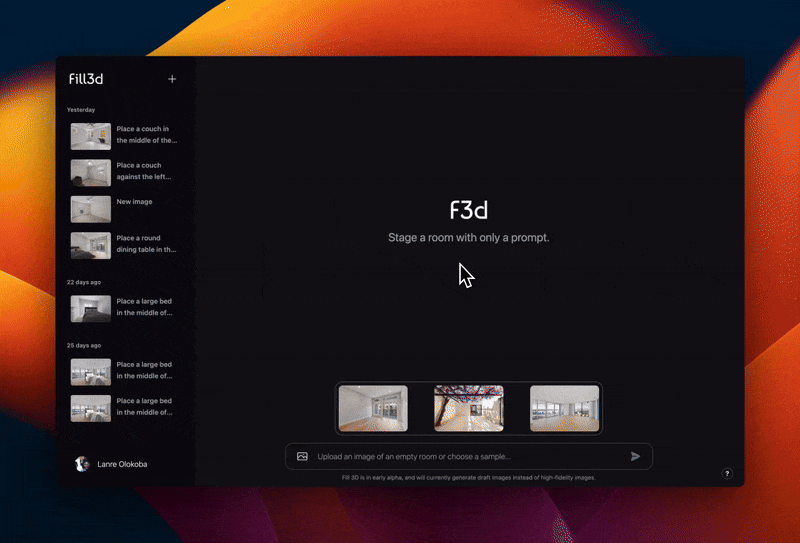

# Fill 3D


[](https://fill3d.ai/community)

Generative Fill in 3D. This is a starter project showcasing the Fill 3D API for AI-powered virtual staging.

## Setup Instructions
1. Clone this repository.
2. Rename `.env.example` to `.env.local`.
3. Head over to [fill3d.ai](https://fill3d.ai/fill) and create an API key:

4. Paste your API key in `.env.local`:
    ```sh
    # Fill 3D
    FILL3D_API_KEY="<your API key here>"
    ```
5. Install dependencies by running `npm install`.
6. Run the development server with `npm run dev`.
7. Open up the webpage at [http://localhost:3000](http://localhost:3000).